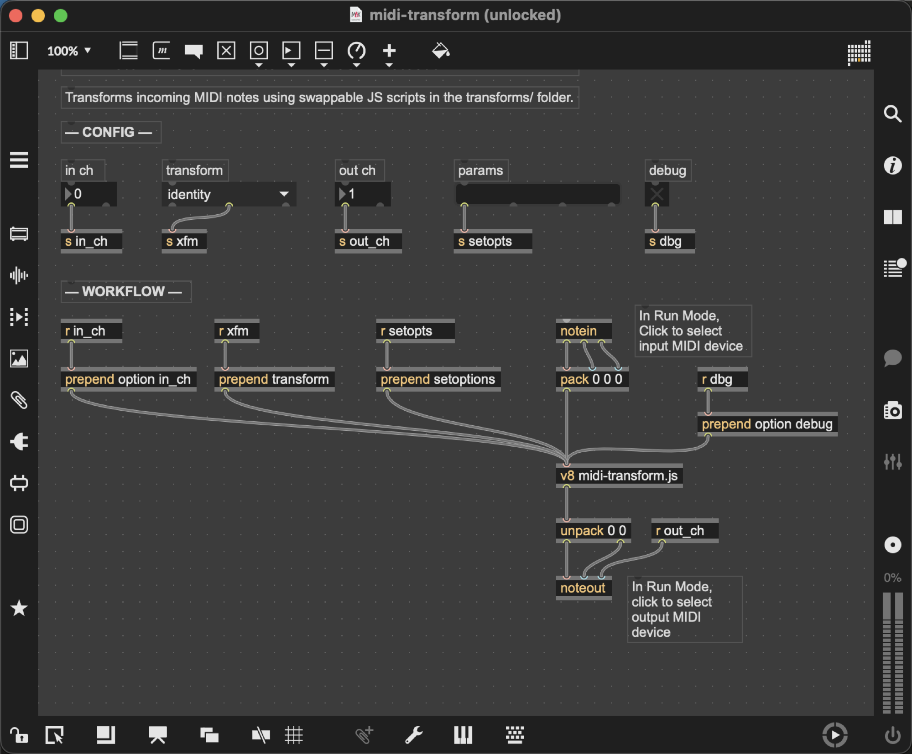

# max-midi-mapper

## About

A Max 9 patch for transforming MIDI notes in real time using swappable JavaScript transform functions. 

The below visualization of the patch shows custom MIDI logic for electronic instruments -- arbitrary pitch and CC transformations written in JavaScript -- living between the MIDI source and the instrument.



> This code has been developed with AI assistance.

## How it works

MIDI input via `notein` → JavaScript transform → `noteout`. The active transform is a small JS module that receives `(pitch, velocity, options)` and returns `[pitch, velocity]`. Transforms are hot-swappable from the patch UI without interrupting the signal chain.

## Configuration

| Parameter | Description |
|-----------|-------------|
| **in ch** | MIDI input channel (0 = all) |
| **transform** | Active transform (selected from `transforms/`) |
| **out ch** | MIDI output channel |

## Transforms

Transform files live in `transforms/`. Each exports a single function:

```js
module.exports = function run(pitch, velocity, options) {
    return [pitch, velocity];
};
```

| File | Description |
|------|-------------|
| `identity.js` | Pass MIDI through unchanged |
| `octave-rand.js` | Randomly shift pitch by ±N octaves (`option neighborhood <n>`) |

To add a new transform, create `transforms/my-transform.js` and add it to the umenu in the patch.

## Development

This project uses [Zed](https://zed.dev) as the editor alongside an AppleScript-based screenshot tool that captures the Max patch window for review. This is particularly useful when working with AI assistance on layout and wiring — you can take a snapshot and share it directly as context.

```sh
# Capture a screenshot of the patch (no extension)
just screenshot midi-transform
```

## Notes

- **JavaScript compatibility**: Max v8 uses a non-standard JS engine — transform scripts must use ES5-style code (`var`, `function`, no arrow functions, no template literals, no destructuring, etc.).
- **Screenshot size**: The screenshot script resizes the output image so the longest dimension is strictly less than 2000px — the image size limit for Zed AI conversations.
- **AppleScript brittleness**: `scripts/screenshot-max.applescript` relies on macOS Accessibility APIs and screen capture permissions. It may require Accessibility and Screen Recording permissions to be granted in System Settings, and may need modification depending on your screen resolution, Max window layout, or OS version.
